[简体中文](README.zh_CN.md) · **English**

# One Fortune

**Open a line. See another side of life. Keep it as your signature.**

<p align="center"></p>

[Community play](https://ai-passport.folotoy.cn/plays/914/) · project **914**.
The sixteen-card album update is submitted as revision **2072**, **pending review**.
Public revision **1967** remains available. Firmware source is `22ef0dd`.
Description, five-step instructions,
and this update's release notes are separate fields. [Bilingual submission copy](assets/fortune/community-copy.json) retains the complete text.
Revision 1967 contains the whole-bank default and explicit topic selector. The Mac simulator is available in this source repository.

One Fortune is a pocket text surprise box. Choose reassurance when you need it,
or explore everyday observations, dry humor, surreal ideas, small insights,
relationship moments, small outings, and attributed classical Chinese poetry.
A sealed letter shakes, opens, and reveals its words. Keep a line you like on a
pixel-art card for display. The interface and texts are Chinese; it works
entirely offline without Wi-Fi setup.

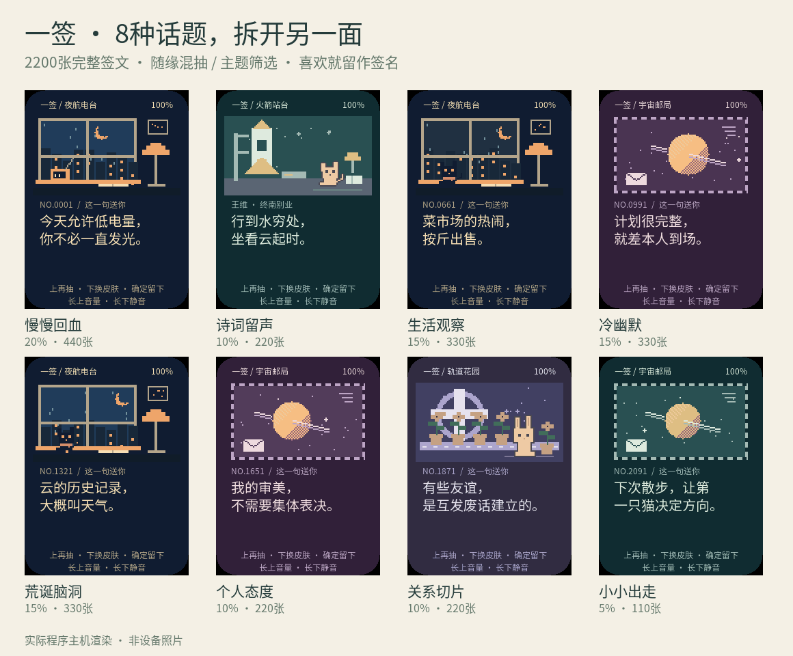

## A different subject in each letter

| Theme | Count and proportion | What it brings |
| --- | --- | --- |
| Gentle recharge | 440 · **20%** | Support and reassurance |
| Classical echoes | 220 · **10%** | Classical poetry with author and work title |
| Everyday observations | 330 · 15% | Details in streets, food, and weather |
| Dry humor | 330 · 15% | A small everyday laugh |
| Surreal ideas | 330 · 15% | An odd new angle on familiar things |
| Small insights | 220 · 10% | Taste, cities, food, reading, technology, and everyday judgments |
| Relationship moments | 220 · 10% | Specific moments between people |
| Small outings | 110 · 5% | A small action to try yourself |

There are **2,200 complete records**: 1,980 original lines and 220 classical
excerpts. The bank retains 440 reassurance notes, with 1,540 original lines across other
subjects. Every record is stored whole; sentences are never assembled from parts.
Home draws from the entire bank by default. Records do not repeat within a cycle,
even after an optional topic draw. All records share one shuffled order, with no
per-theme scheduling quota; a short sample can contain zero or several poems.
Returning home or restarting restores the whole-bank scope. The hidden voice
filter is retired. Topics require confirmation on a separate, large-text page.
All 220 insight lines and 92 humor lines were rewritten; first-person openings
fell from 320 to 21 across the bank, including three unchanged poetry excerpts.
The original 10,001+ independently authored target remains future work.
Visual combinations are counted separately from written content.

## Start in five steps

1. Turn on the device; it works offline with no Wi-Fi setup. Press any button once to wake a dark screen. If your signature appears, hold OK to return home.
2. Press OK on home for a random draw. Wait for the letter to reveal its words, or press OK to skip. For a specific theme, open the selector with UP/DOWN, choose a theme and confirm with OK.
3. On the result, UP draws again, DOWN changes the artwork, and OK collects the card and displays it as your signature. Keep up to 16 cards; when full, choose an old card and confirm its replacement.
4. Hold OK on home, or press OK on the signature, to open the album. Browse with UP/DOWN; OK opens actions to display, change artwork or remove a card. Hold OK to step back to home and continue drawing.
5. On a card, hold UP for volume, adjust with UP/DOWN and press OK to save; hold DOWN to toggle sound. Favorites, your signature and sound settings survive restarts.

Drawing keeps your existing signature until you explicitly save a replacement.
Changing artwork preserves the words. Previously saved signatures and artwork
remain readable after this upgrade.

<p align="center">
  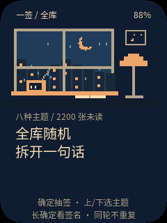
  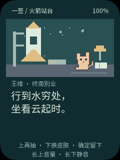
</p>

## Keep sixteen favorite cards

This update holds **16 complete cards with their artwork**, entirely
on the offline device. UP/DOWN browses; OK opens actions to display the card,
change its artwork or remove it. Browsing never changes the signature or writes
storage. Removing a favorite retains the independently displayed signature.
When full, select an old card, preview the new one and explicitly confirm replacement;
cancel is selected by default. Hold OK to step back. Recollecting the same quote
updates its artwork without taking another slot. Existing signatures migrate into
slot one with their exact words, artwork, read history and sound settings intact.
Turns take about 200 ms; successful collection shows a 480 ms bookmark seal.
Animation frames never write Flash. This feature is not yet in the public community
release; physical button feel, frame timing, interrupted saves and endurance await testing.
Build and Host tests PASS for this change; the application is 1,519,760 bytes
and the merged image 1,585,296 bytes. Device tests PASS for three component write
hashes and a 20-second startup observation only. NVS and PHY were excluded;
matching ELF, one boot, 216684 free heap bytes and a 114688-byte largest block
were observed, with no crash or rejected state. Physical acceptance remains pending.

## Give the words a different setting

Ten pixel-art collections combine **80 scenes × four companions = 320 skins**,
each in six palettes: **1,920 appearances**. Each shuffled cycle covers every
combination, with different adjacent scenes. Text stays still while the scenery
has small ambient movements.

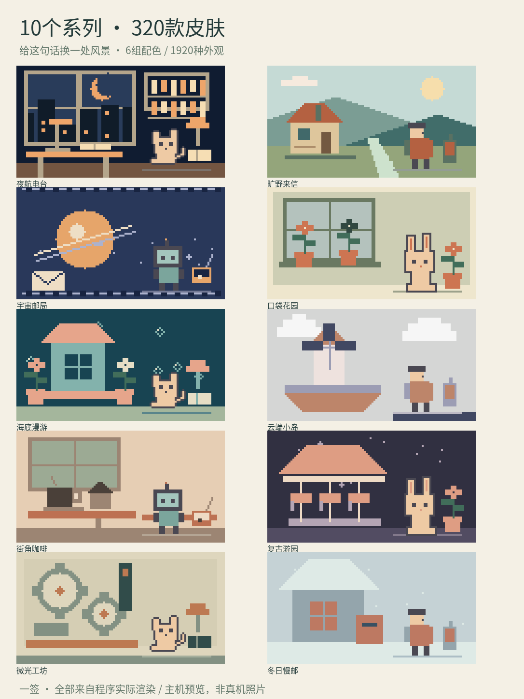

[See all 320 skins](assets/images/fortune-skins-overview.png), or open the
[interactive gallery](assets/fortune/skin-gallery.html) locally to filter by
collection, companion, and palette and click to enlarge. Keep the adjacent
image directory when downloading it.

<p align="center">
  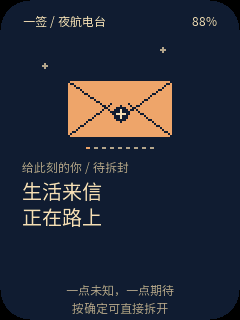
  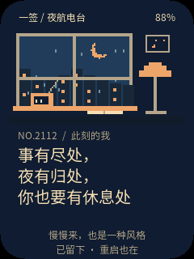
</p>

These are application host renders, not device photographs. The animations
retain prior-version text as motion examples.

## Choose your sound

Short original music-box cues accompany opening, reveal, keeping, and artwork
changes. Hold UP on a card for volume. UP/DOWN changes it from 10% to 100% in
10% steps, with an audition. OK saves and enables sound; hold OK to cancel and
restore the old volume and mute setting. Default volume is 80%.
Hold DOWN on a card to mute or restore sound without losing the chosen volume.

<p align="center">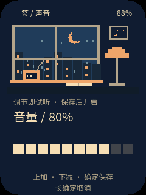</p>

[Listen to the audition](assets/music/fortune-audition.wav). It is exported by
the firmware sound generator and excluded from firmware; speaker loudness
still needs device listening. The lines offer reading, expression, and
entertainment, without predictions.

## Try it on a Mac first

Double-click `tools/Launch-Fortune-Simulator.command`, or run:

```bash
python3 tools/fortune_simulator/server.py
```

The local browser simulator runs the real firmware input, model, corpus, LVGL
interface, fonts and pixel artwork. Use the three buttons or Up/Down/Enter; hold
for 0.5 seconds. Check the current scope and draw history, draw 20 at once,
restart, or use a seed to reproduce a run. It does not access USB or device data.
See [Mac simulation and limits](docs/fortune-simulator.md).

<p align="center">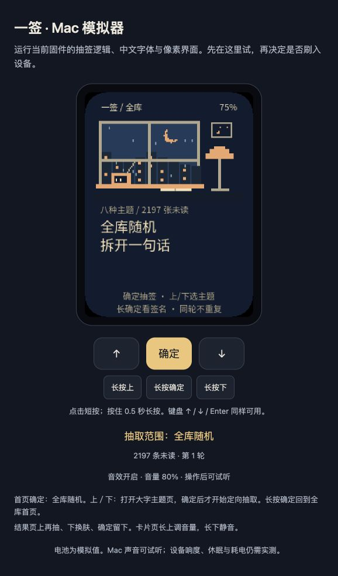</p>

<p align="center">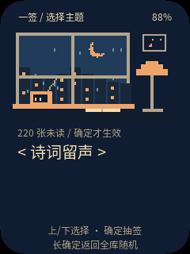</p>

## Development, builds, and tests

Read [AGENTS.md](AGENTS.md) and the [build guide](docs/development/engineering/build-and-test.md).
The application reuses BSP and owns its pages. Activate ESP-IDF 5.5.3, then run:

```bash
./tools/validate.sh
./tools/test_fortune_ui.sh --skins
# Use a Python with Pillow 11.3.0 installed
python3 tools/render_fortune_gallery.py
python3 tools/render_fortune_topics.py
```

The complete gate produces `build/FoloToy-AI-Passport-full.bin` for **0x0**.
Matching images, ELF, MAP, and manifest are archived under
`build/firmware/<full-image-sha256>/`. Firmware and private logs stay out of Git.
A merged write can overwrite stored data; preserving old signatures requires compatible segmented
writing. This update used verified component images and left NVS and PHY untouched.
See the [flashing and data policy](docs/development/engineering/firmware-layout.md#flashing-and-stored-data).

| Check | Previous community iteration, before favorites |
| --- | --- |
| Build | **PASS** — ESP-IDF 5.5.3 complete gate and verified 0x0 merged image |
| Host tests | PASS — exact decoding, proportions and poetry sources, legacy migration, input and storage; active fonts and all text layouts, 1,920 artwork renders |
| Device tests | **PASS for write/startup only** — `00878f6`, three verified component writes and 20 seconds of startup observation; matching ELF, no crash or rejected save |
| Unverified | Physical theme selection and Chinese readability, old-signature recovery, volume/mute recovery, sound quality, animation smoothness, interrupted writes, idle/wake, battery reporting and endurance; perceived text repetition |

The active encoded text bank takes **67.0 KiB**, plus attribution and legacy
compatibility data. The **57.3 KiB** old bank serves saved signatures only and is
excluded from new draws. A further **18.5 KiB** retains the 312 replaced lines
and their migration table. Both font sizes cover **2,296 characters**; the whole
bank is never loaded into RAM. The 16-card save is **455 bytes**, importing older 323/312-byte saves, with separate
one-byte volume and mute preferences. Procedural artwork retains its
12,528-byte canvas; gallery images stay out of firmware.
The previous community application is **1,513,840 bytes**; its merged image is **1,579,376 bytes**.
See the [product and engineering design](docs/fortune-card.md) for measurements
and compatibility boundaries.

## Community gameplay images

These images show the current whole-bank default, explicit selector and sixteen-card album.

The updated cover uses built-in imagegen editing. Four detail images use actual
application host renders, not device photographs. [Methods and cover prompt](assets/fortune/community-artwork.json) retain their provenance.

<p align="center">
  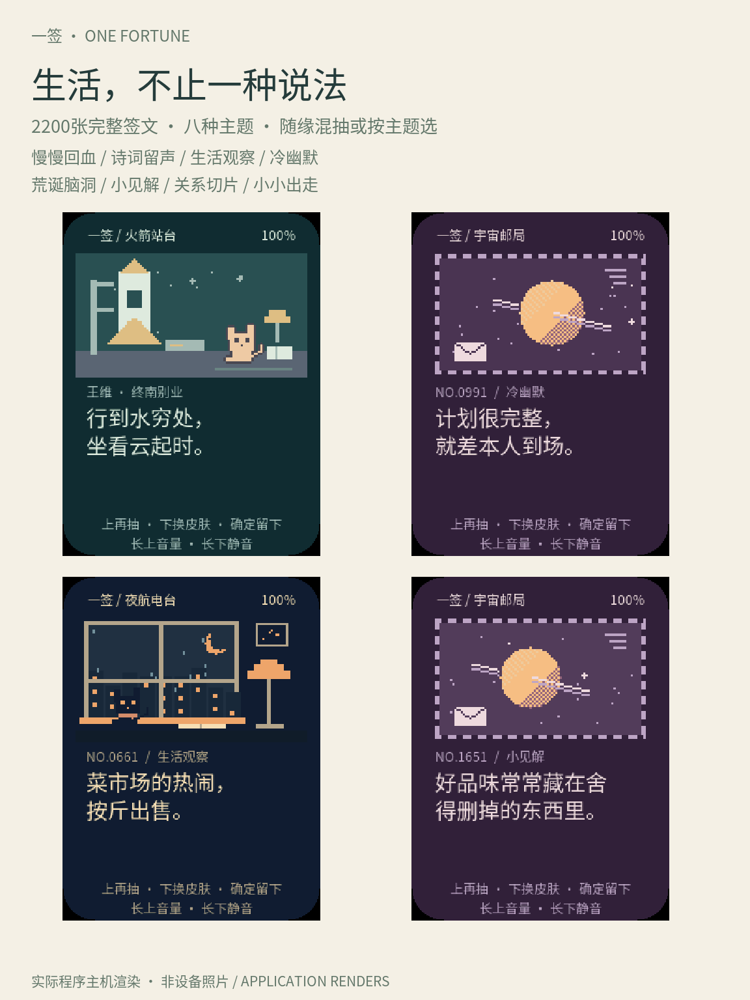
  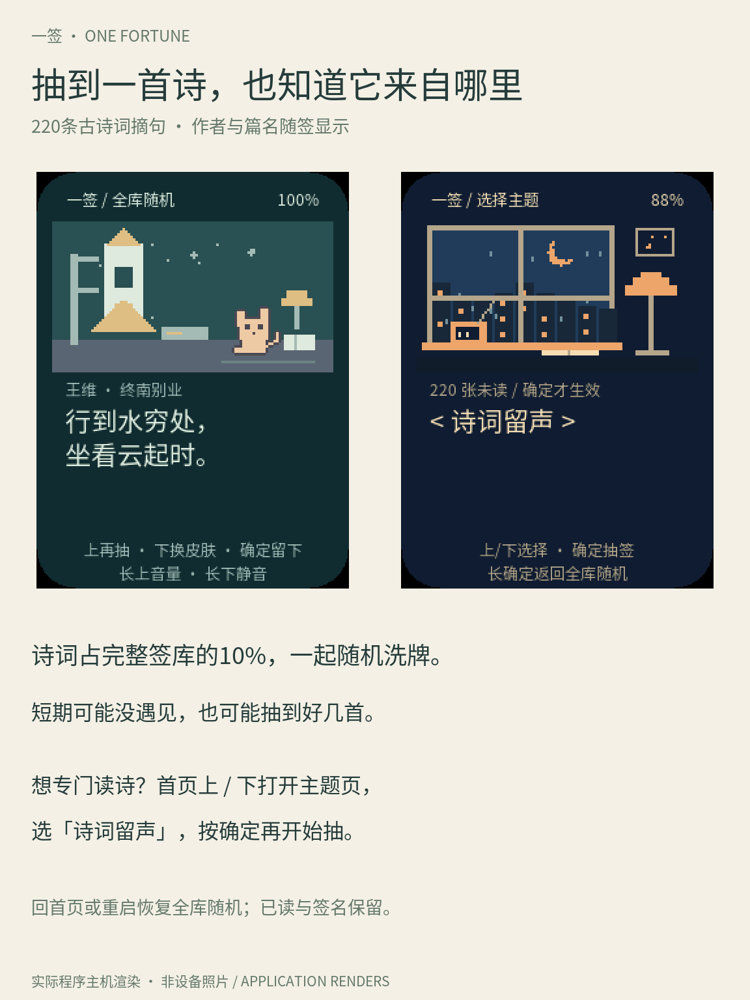
</p>
<p align="center">
  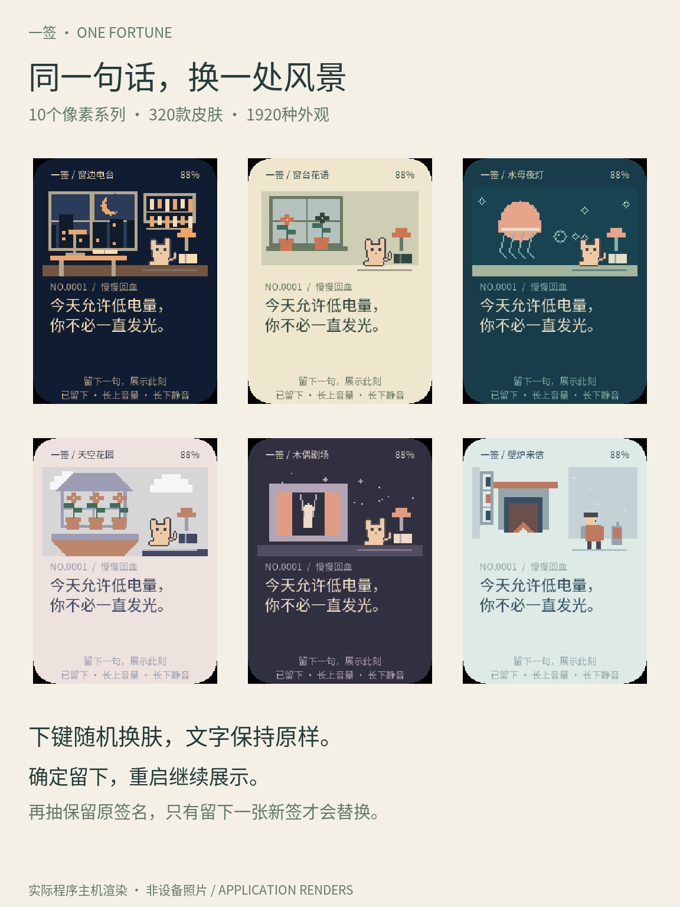
  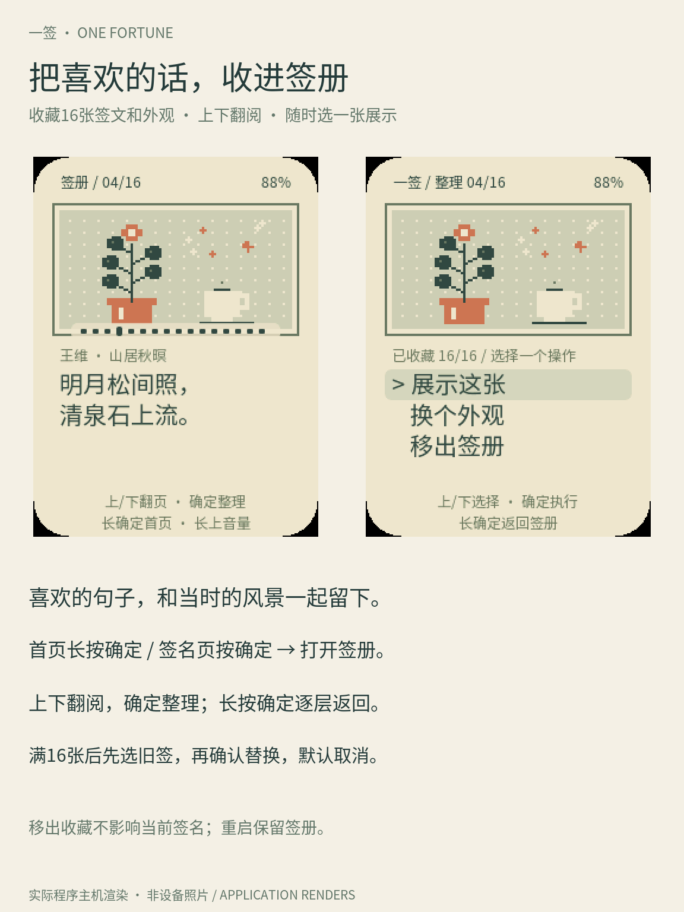
</p>

## Explore or extend

- [Product, storage, controls, and acceptance](docs/fortune-card.md)
- [Complete themed corpus](assets/fortune/corpus.json) and [poetry sources](assets/fortune/poetry-sources.json)
- [Application entry](main/main.c) and [pixel renderer](main/fortune_pixels.c)
- [Asset sources and licenses](assets/README.md)
- [Upstream hardware and development documents](docs/README.md)

Original code and assets use the [MIT license](LICENSE). Classical texts are
public-domain works checked against the [chinese-poetry collection](https://github.com/chinese-poetry/chinese-poetry).
Its [MIT license](assets/fortune/sources/chinese-poetry-LICENSE.txt) and pinned
source records are retained. Long titles are abbreviated on cards; source data
retains full titles. Noto Sans CJK keeps its [SIL Open Font License](assets/fonts/OFL.txt).
The upstream platform is [FoloToy AI Passport](https://github.com/FoloToy/ai-passport).
