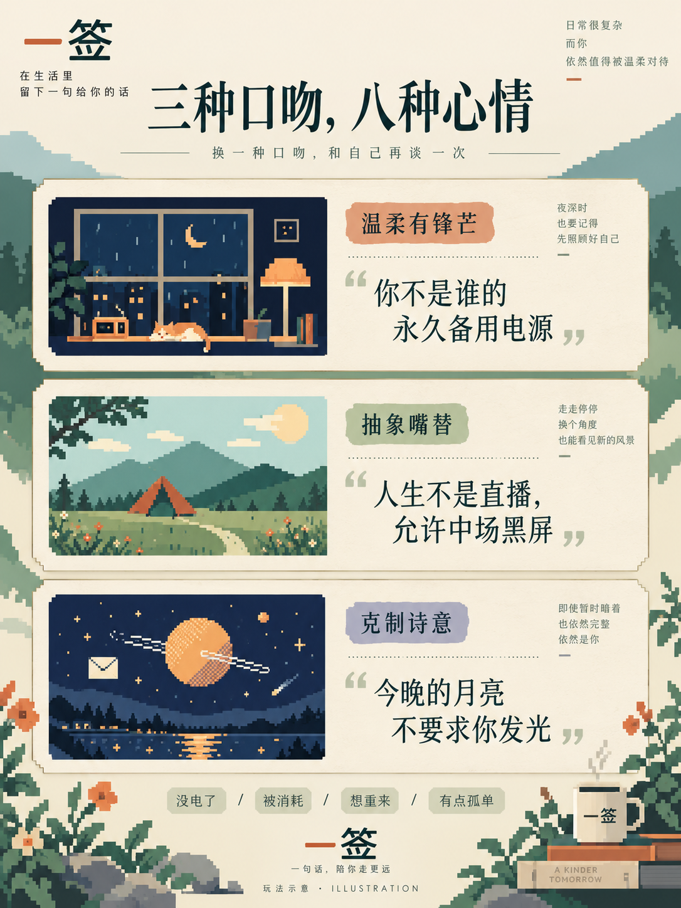
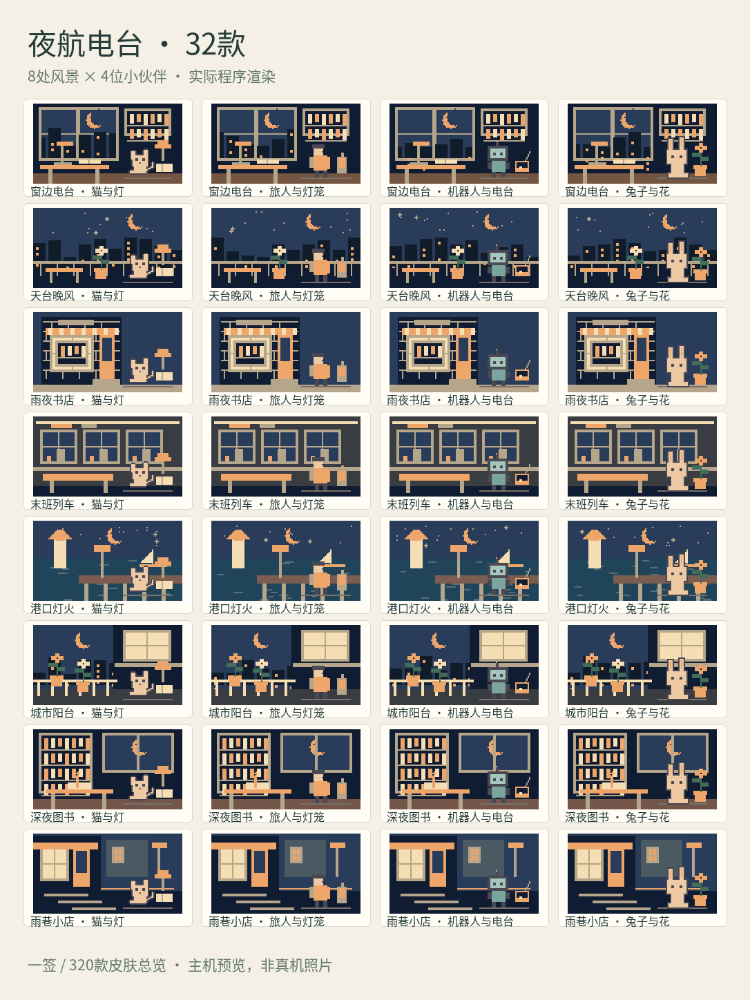
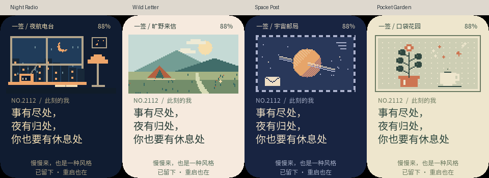

[简体中文](README.zh_CN.md) · **English**

# One Fortune

**Open a letter. Find a line that gets you. Keep it as your signature.**

One Fortune turns AI Passport into a pocket collection of encouraging, witty,
and quietly poetic notes. When a day feels draining, choose a mood and open an
unknown letter. Keep a line you like on a pixel-art card, ready to display as
your personal signature. It works entirely offline, with a Chinese interface
and Chinese fortunes.

<p align="center">
  
</p>

| Complete fortunes | Voices | Pixel-art collections | Scenes and subjects |
| --- | --- | --- | --- |
| **2,112** independently authored lines | Warm and assertive, playful internet humor, restrained poetry | Night Radio, Wildland Letters, Cosmic Post, Pocket Garden, Undersea Wandering, Cloud Islands, Corner Cafe, Vintage Fair, Glow Workshop, Winter Post | **320 skins**, each in **6 palettes** |

The current release contains 2,112 complete fortunes. The original goal of more
than 10,000 independently authored lines remains a future expansion. Scene
variations are counted separately from written content. The new collection combines
80 distinct scenes with four companions: a cat, traveler, robot, and rabbit.
Each 320-change batch covers all skins; adjacent scenes differ. Six
palettes give 1920 selectable appearances before the appearance cycle repeats.

## A small ritual for a difficult day

Choose a mood, or leave it to chance. A sealed envelope shakes, opens, and lifts
its letter before the note appears. The reveal takes about 1.25 seconds; press
OK to skip it. Drawing again keeps your existing saved signature until you
explicitly save a replacement.

Three voices cover moments when you want reassurance, a funny line that says
what you are thinking, or a little quiet poetry. Fortunes do not repeat within
a draw cycle, even when you change filters. There are no daily quotas,
streaks, rarity ranks, accounts, or payment steps.

<table>
  <tr>
    <td></td>
    <td></td>
  </tr>
  <tr><td>Choose a mood and unwrap a note.</td><td>Find a voice that fits the moment.</td></tr>
  <tr>
    <td></td>
    <td></td>
  </tr>
  <tr><td>Ten collections, with small ambient movements.</td><td>Keep the words; change their setting.</td></tr>
</table>

*The cover and three explanatory posters are AI-generated gameplay illustrations.
The Night Radio overview comes from the actual application renderer.*

## Explore every skin


[View all 320 skins in one full overview](assets/images/fortune-skins-overview.png).

Open the [complete interactive gallery](assets/fortune/skin-gallery.html) locally
in a browser to view all 320 full cards, switch among six palettes, filter by
collection or companion, and click to enlarge. Keep the adjacent image directory
when downloading it. The gallery includes all 1920 completed application renders.
Existing saved cards retain their original artwork; drawing or changing the
appearance enters the new collection.

## Start in five steps

1. Turn on the device. It works offline without Wi-Fi setup. If the display is off, press any button once to wake it.
2. On the mood page, use UP/DOWN to choose a mood. Hold DOWN to change the voice, then press OK to draw.
3. Watch the envelope open with a short musical build-up and a reveal chime. Press OK during the opening animation to reveal it immediately.
4. On the result page, press UP to draw again or DOWN to change only the artwork. Press OK to save this note as your signature. Hold UP on a card to adjust volume, or hold DOWN to mute; both settings are remembered.
5. Hold OK to return to the mood page; hold OK there to view your saved signature. Restarting restores it. Drawing again keeps it until you save another note.

Fortunes offer encouragement and entertainment. They make no predictions or
promises about what will happen.

## A little sound for the reveal

Soft, original music-box notes build anticipation as the letter opens, then settle
into a short chime as the words appear. Saving a signature has a gentle two-note
stamp; changing artwork adds a tiny sparkle. Four related melodic variations keep
the ritual fresh. Skipping the opening immediately switches to the reveal cue.

Sound starts enabled at 80%. On the result or signature page, **hold UP** to
open volume: UP/DOWN changes it in 10% steps from 10% to 100%, with a short
preview at each step. Press OK to save and enable sound; hold OK to cancel and
restore the previous volume and mute state. Volume survives restarts.

Hold **DOWN on a card** to mute or unmute without losing your chosen volume.
The mood page retains its existing hold-DOWN voice selection.

<p align="center"></p>

[Listen to the complete audition](assets/music/fortune-audition.wav): opening,
reveal, saved signature, then artwork change. Try the four draw variations:
[1](assets/music/fortune-draw-1.wav), [2](assets/music/fortune-draw-2.wav),
[3](assets/music/fortune-draw-3.wav), [4](assets/music/fortune-draw-4.wav).
These files come from the firmware's actual sound renderer; the device speaker's
tone and loudness still need on-device listening. WAV previews are not embedded
in the firmware.

## See the actual interface

These previews come from the application's host renderer, including its fonts,
layout, and rounded display mask. They are not on-device photographs.



<p align="center">
  
  
</p>

*Letter opening and ambient motion, shown with compatible original artwork.
Text remains still and readable.*

## Build and verification

Read [AGENTS.md](AGENTS.md), the [environment guide](docs/development/engineering/environment-setup.md),
and the [build guide](docs/development/engineering/build-and-test.md). This
application reuses the upstream BSP and provides its own pages and interaction
flow. Activate ESP-IDF 5.5.3, then run:

```bash
./tools/validate.sh
./tools/test_fortune_ui.sh --skins
python3 -m venv build/gallery-venv
build/gallery-venv/bin/pip install Pillow==11.3.0
build/gallery-venv/bin/python tools/render_fortune_gallery.py
```

The complete gate builds and verifies a merged image at
`build/FoloToy-AI-Passport-full.bin` for flashing from **0x0**, with its matching
ELF, MAP, and manifest archived under `build/firmware/`. Generated firmware and
private device logs are excluded from Git. Follow the [flashing and data policy](docs/development/engineering/firmware-layout.md#flashing-and-stored-data)
before writing a device.

| Check | Current result |
| --- | --- |
| Build | **PASS** — complete gate and merged-image verification |
| Host tests | **PASS** — all text layouts and active fonts, reveal/skip sound events, 16 synthesized cues, volume preview/save/cancel/reload and worker mute/cancellation/fault recovery, 64 shuffled-skin seeds, all 1920 renders, legacy save compatibility and unchanged legacy pixels |
| Device tests | **PASS** for segmented write, hashes and a 20-second matching startup of `7db813f`; volume-panel use and loudness await user acceptance. The first audio version was audible but too quiet at 60% |
| Unverified | Speaker loudness, crackles, reveal synchronization, persisted mute and rapid-operation playback on hardware; physical button interactions, on-device Chinese legibility and clipping, animation smoothness, saved-signature recovery after restart or interrupted writes, idle/wake behavior, battery accuracy, power consumption, and endurance |

The complete encoded text bank takes **57.3 KiB**. Artwork is drawn from scene
rules rather than a library of stored backgrounds; the canvas uses **12,528
bytes** of RAM. The application with sound is **1,253,840 bytes**, an increase
of **67,296 bytes (65.7 KiB)** over the ten-collection release, including the
audio playback stack. The synthesized scores and waveform tables use about 680 bytes. The card save remains **312 bytes**, with separate one-byte mute and volume preferences. Gallery PNGs and audition WAVs are excluded
from the firmware. These measurements and test boundaries are detailed in the
[product and engineering design](docs/fortune-card.md).

## Explore or extend

- [Product design, controls, storage, and acceptance](docs/fortune-card.md)
- [Complete authored corpus](assets/fortune/corpus.json)
- [Application source](main/main.c) and [pixel-art renderer](main/fortune_pixels.c)
- [Asset sources, licenses, and image provenance](assets/README.md)
- [AI illustration prompts](assets/fortune/publication-image-prompts.json)
- [Upstream hardware and development documentation](docs/README.md)

Application code and original project assets follow the repository's
[MIT license](LICENSE). Noto Sans CJK font assets retain their
[SIL Open Font License](assets/fonts/OFL.txt). The upstream platform is
[FoloToy AI Passport](https://github.com/FoloToy/ai-passport).
