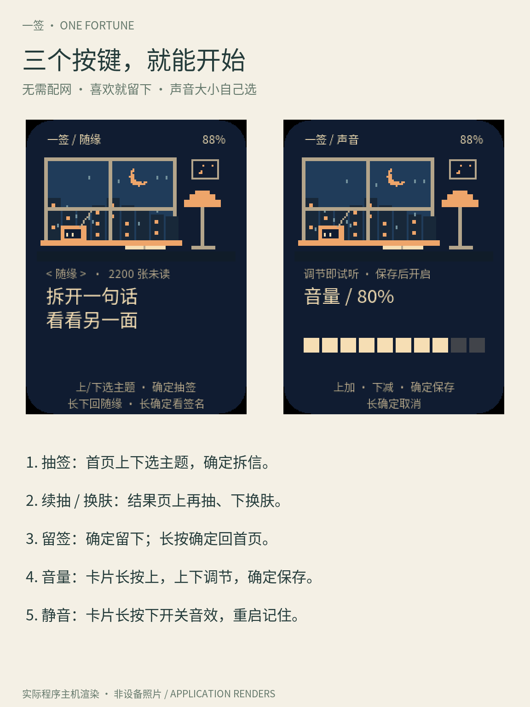

**简体中文** · [English](README.md)

# 一签

**拆开一句话，看看生活的另一面。喜欢，就留作签名。**

<p align="center"></p>

[社区玩法](https://ai-passport.folotoy.cn/plays/community-aeba5ed2/) · 项目 **914**。
本次提交版本 **1962**（固件代码 `38ad745`）为**待审核**；当前公开版本仍为 **1942**。
简介、五步使用方法和本次更新日志分别提交，[中英文发布资料](assets/fortune/community-copy.json)保留完整文本。

一签是一只随身的文字盲盒。想被安慰时，可以抽「慢慢回血」；想换换脑子时，
还有生活观察、冷幽默、荒诞脑洞、小见解、关系切片、小小出走，以及标明出处的古诗词。
封好的信轻轻晃动、拆开、揭晓。喜欢哪一句，就让它留在像素卡片上展示。
中文界面，完全离线，无需配网。


## 每次打开，可以是不同的话题

| 主题 | 数量与比例 | 抽到的感觉 |
| --- | --- | --- |
| 慢慢回血 | 440 张 · **20%** | 留一点支持和安慰 |
| 诗词留声 | 220 张 · **10%** | 古诗词摘句，显示作者和篇名 |
| 生活观察 | 330 张 · 15% | 看见街道、食物、天气里的小细节 |
| 冷幽默 | 330 张 · 15% | 日常里的一个笑点 |
| 荒诞脑洞 | 330 张 · 15% | 给熟悉的东西一个奇怪的新解释 |
| 小见解 | 220 张 · 10% | 审美、城市、食物、阅读、科技里的小看法 |
| 关系切片 | 220 张 · 10% | 人与人相处的具体瞬间 |
| 小小出走 | 110 张 · 5% | 一件可以亲自试的小事 |

共 **2,200 张完整签文**：1,980 条原创短句与 220 条古诗词摘句。
当前保留 440 条安慰签，其余 1,540 条原创内容覆盖不同话题；逐条存储，不拼接句子。
选择「随缘」可混抽全部主题；同一轮不重复，切换主题也记住已读记录。
新的一轮「随缘」每 20 张含 2 张诗词，顺序随机打散；切换主题后的已读跳过会改变短期比例。
口吻筛选已取消，旧偏好不会再排除诗词。「小见解」220 条和冷幽默 92 条重新创作，
整库以“我”开头的内容从 320 条降到 21 条（包含 3 条保留原文的诗词）。
最初的一万条以上独立签文仍是后续目标，外观组合不计入签文数量。

## 五步上手

1. 开机即可使用，无需配网；屏幕熄灭时先按任意键唤醒。
2. 首页用上/下键选主题，也可以随缘；长按下键回到随缘，按确定抽签。
3. 等信封展开、签文揭晓，拆信时按确定可跳过动效。
4. 结果页按上再抽、按下随机换肤；按确定留下这句话，作为个人签名展示。
5. 长按确定返回首页；在首页长按确定查看签名。卡片页长按上调音量、长按下静音，重启会记住签名和设置。

再抽会保留原签名，只有确定留下另一张才会替换；换肤只改变外观。
旧版已经固定的签名和皮肤可以继续显示。

<p align="center">
  
  
</p>

## 给这句话，换一处风景

十个像素系列包含 **80 处场景 × 4 位小伙伴 = 320 款皮肤**，各有六组配色，
共 **1,920 种外观**。随机换肤每轮覆盖全部组合，相邻场景不同；文字保持静止，
风景带一点安静的微动效。


[看全部 320 款总览](assets/images/fortune-skins-overview.png)，或在本地浏览器打开
[完整互动图库](assets/fortune/skin-gallery.html)，筛选系列、小伙伴与配色，点击放大。
下载时保留旁边的图片目录。

<p align="center">
  
  
</p>

以上都是程序主机渲染，非设备照片。动图保留旧版签文作动效示例。

## 声音也由你决定

拆信、揭晓、留签和换肤有短小的原创音乐盒音效。
卡片页长按上键进入音量页，上下键以 10% 为一步调节，范围 10%～100%，调节时试听。
按确定保存并开启声音；长按确定取消，恢复原音量和静音状态。默认音量 80%。
卡片页长按下键可静音或恢复，不会丢掉选好的音量。

<p align="center"></p>

[听完整试听](assets/music/fortune-audition.wav)。这些 WAV 由固件音频生成器导出，
不进入固件；实际响度需通过设备扬声器试听。
签文用于阅读、表达和娱乐，不作未来预测。

## 开发、构建与测试

先读 [AGENTS.md](AGENTS.md) 和[构建指南](docs/development/engineering/build-and-test.zh_CN.md)。
应用复用 BSP，拥有独立页面。激活 ESP-IDF 5.5.3 后运行：

```bash
./tools/validate.sh
./tools/test_fortune_ui.sh --skins
# 使用安装了 Pillow 11.3.0 的 Python
python3 tools/render_fortune_gallery.py
python3 tools/render_fortune_topics.py
```

完整门禁生成从 **0x0** 刷写的 `build/FoloToy-AI-Passport-full.bin`，
匹配的镜像、ELF、MAP 和清单归档于 `build/firmware/<完整镜像SHA256>/`。
固件和私有日志不提交 Git。合并镜像可能覆盖已存数据；保留旧签名时应使用兼容的分段写入，本轮采用该方式，未覆盖 NVS。
详见[刷写与数据政策](docs/development/engineering/firmware-layout.zh_CN.md#烧录与已存数据)。

| 检查 | 本轮结果 |
| --- | --- |
| Build | **PASS**：ESP-IDF 5.5.3 完整门禁与 0x0 合并镜像校验 |
| Host tests | PASS：完整解码、主题比例与诗词来源、旧存档迁移、按键与存储；实际字体和全部签文排版、1,920 个外观渲染 |
| Device tests | **PASS**（写入与启动）：`38ad745` 三个组件哈希匹配、20 秒匹配启动，未覆盖 NVS；屏幕与操作仍待用户验收 |
| Unverified | 真机主题切换与中文可读性、旧签名恢复、音量和静音恢复、声音质量、动效流畅度、断电恢复、闲置唤醒、电量与续航；文案的主观重复感 |

当前编码文本占 **67.0 KiB**，另有出处与旧签名兼容数据。仅为兼容旧签名保留的旧签库占
**57.3 KiB**；另存 312 条本轮替换前的签文及迁移表约 **18.5 KiB**，均不会混入新抽取。两种字号各覆盖 **2,295 个字符**；无需加载整库到 RAM。
卡片存档为 **323 字节**，音量和静音各用独立的一字节偏好值。
外观由代码绘制，像素画布仍用 12,528 字节 RAM，图库图片不进入固件。
应用镜像为 **1,515,360 字节**，合并固件为 **1,580,896 字节**。完整测量和兼容边界见[产品与工程设计](docs/fortune-card.zh_CN.md)。

## 社区玩法图

新版封面由内置 imagegen 编辑；四张详情图使用实际程序主机渲染，非设备照片。
[制作方法与封面提示词](assets/fortune/community-artwork.json)保留来源与生成记录。

<p align="center">
  
  
</p>
<p align="center">
  
  
</p>

## 阅读与扩展

- [产品设计、存储、按键和验收](docs/fortune-card.zh_CN.md)
- [完整主题签库](assets/fortune/corpus.json)与[古诗词来源](assets/fortune/poetry-sources.json)
- [应用入口](main/main.c)与[像素画面生成器](main/fortune_pixels.c)
- [素材来源与许可](assets/README.zh_CN.md)
- [上游硬件与开发文档](docs/README.zh_CN.md)

本项目原创代码与素材使用 [MIT 许可证](LICENSE)。古诗词为公有领域作品，摘句、作者与篇名
核对自 [chinese-poetry 数据库](https://github.com/chinese-poetry/chinese-poetry)，保留其
[MIT 许可](assets/fortune/sources/chinese-poetry-LICENSE.txt)和固定版本来源记录；长篇名在卡片中缩略，源数据保留全名。
Noto Sans CJK 字体保留 [SIL Open Font License](assets/fonts/OFL.txt)。
上游平台为 [FoloToy AI Passport](https://github.com/FoloToy/ai-passport)。
